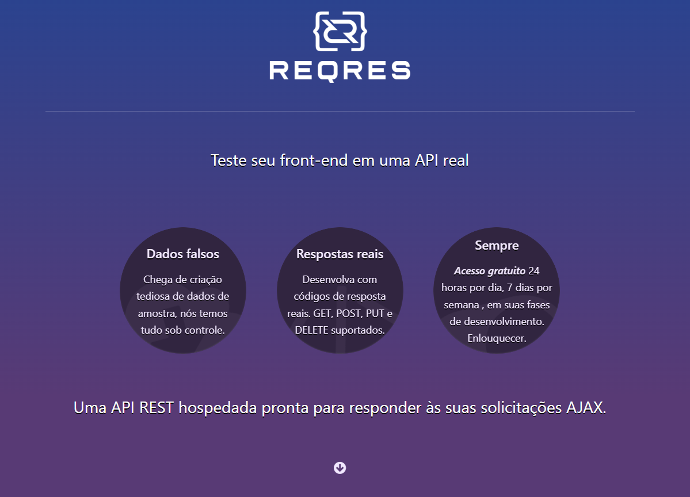
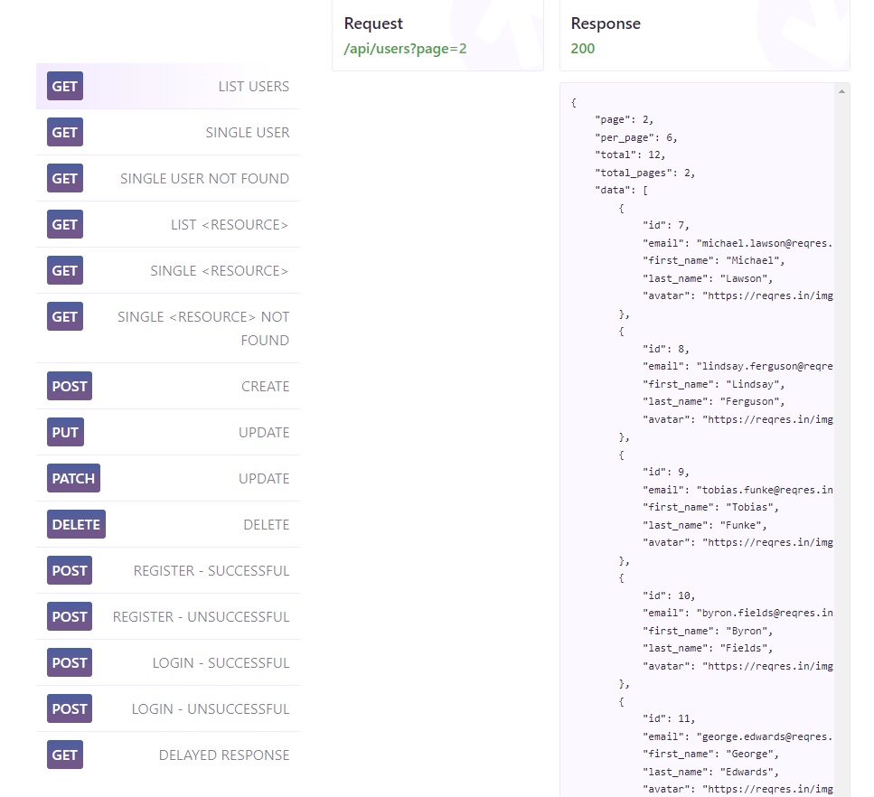

# Teste de API com Rest Assured

Este repositório contém testes automatizados para a [API Reqres](https://reqres.in/), utilizando a biblioteca Rest Assured para validação de requisições e respostas HTTP.



## Índice

- [Introdução](#introdução)
- [Configuração](#configuração)
- [Testes Implementados](#testes-implementados)
  - [Obter Lista de Usuários](#obter-lista-de-usuários)
  - [Obter Usuário Único](#obter-usuário-único)
  - [Usuário Único Não Encontrado](#usuário-único-não-encontrado)
  - [Obter Lista de Recursos](#obter-lista-de-recursos)
  - [Criar Usuário](#criar-usuário)
  - [Atualizar Usuário](#atualizar-usuário)
  - [Deletar Usuário](#deletar-usuário)
- [Executando os Testes](#executando-os-testes)
- [Conclusão](#conclusão)

## Introdução

Este projeto demonstra como testar APIs RESTful usando Rest Assured em Java. Os testes focam em validar diferentes endpoints fornecidos pela API Reqres, garantindo a funcionalidade correta e as respostas esperadas.




## Configuração

Para executar estes testes, você precisa do seguinte:

- Java Development Kit (JDK) 8 ou superior
- Maven

  Clone o repositório e navegue até o diretório do projeto:

## bash
git clone (https://github.com/carolineoliveiraa/curso-rest-assured.git)

## Testes Implementados

### Obter Lista de Usuários

- **Descrição**: Teste para recuperar uma lista de usuários da página 2 e validar os dados da resposta.
- **Endpoint**: `GET /api/users?page=2`
- **Validações**:
  - Código de status 200
  - Página é 2
  - 6 usuários por página
  - Total de 12 usuários
  - 2 páginas no total
  - Primeiro usuário tem ID 7
  - Primeiro usuário se chama Michael Lawson
  - URL do avatar do primeiro usuário é `https://reqres.in/img/faces/7-image.jpg`

### Obter Usuário Único

- **Descrição**: Teste para recuperar as informações de um único usuário e validar os dados da resposta.
- **Endpoint**: `GET /api/users/2`
- **Validações**:
  - Código de status 200
  - ID do usuário é 2
  - Email do usuário é `janet.weaver@reqres.in`
  - Nome do usuário é Janet Weaver
  - URL do avatar do usuário é `https://reqres.in/img/faces/2-image.jpg`
  - URL de suporte é `https://reqres.in/#support-heading`
  - Texto de suporte confirma a gratuidade do serviço

### Usuário Único Não Encontrado

- **Descrição**: Teste para verificar a resposta ao solicitar um usuário não existente.
- **Endpoint**: `GET /api/users/23`
- **Validações**:
  - Código de status 404
  - Resposta contém um mapa vazio

### Obter Lista de Recursos

- **Descrição**: Teste para recuperar uma lista de recursos e validar o tamanho dos dados retornados.
- **Endpoint**: `GET /api/unknown`
- **Validações**:
  - Código de status 200
  - Tamanho da lista de dados é 6

### Criar Usuário

- **Descrição**: Teste para criar um novo usuário e validar os dados da resposta.
- **Endpoint**: `POST /api/users`
- **Corpo da Requisição**:
  ```json
  {
    "name": "morpheus",
    "job": "leader"
  }

### Validações

- Código de status 200
- Nome do usuário é "morpheus"
- Cargo do usuário é "leader"
- Data de atualização contém a data atual

### Deletar Usuário

- **Descrição**: Teste para deletar um usuário e validar o código de status da resposta.
- **Endpoint**: `DELETE /api/users/2`
- **Validações**:
  - Código de status 204

## Executando os Testes

Para executar os testes, utilize o seguinte comando Maven:

```bash
mvn test
